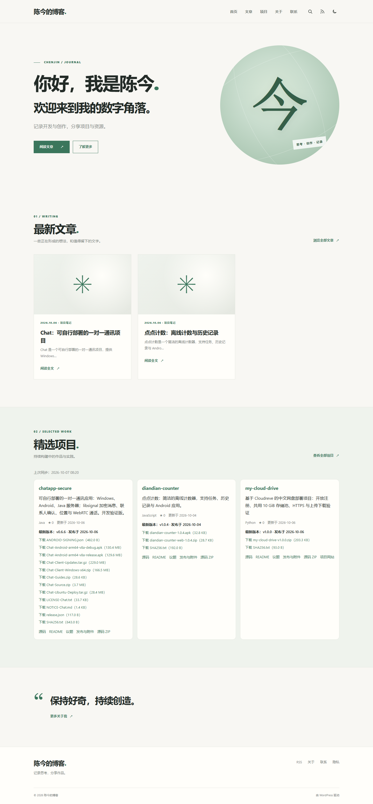

# 陈今的个人博客

以 [WordPress](https://github.com/WordPress/WordPress) 为成熟内容管理基础，提供中文后台、独立个人主题和 GitHub 开源资源目录。

**在线博客：<https://121.43.101.242/blog/>**

**后台入口：<https://121.43.101.242/blog/wp-admin/>**

**下载：** [部署源码、主题、插件与校验文件](https://github.com/wobuyaoquminga/chenjin-blog/releases/tag/v1.0.1)。



## 功能

- 文章：区块编辑器、草稿、修订、定时发布、分类、标签、特色图片、附件、搜索、分页与 RSS。
- 阅读：响应式布局、深浅主题、文章目录、代码复制、上一篇/下一篇、评论与回复。评论需要站长审核。
- 项目：自动同步 `wobuyaoquminga` 全部公开仓库；搜索、语言筛选、排序、源码、README、Issues、版本发布与源码 ZIP。私有仓库不公开。
- 管理：中文后台、菜单、Logo、媒体库、用户角色、导入/导出；站点与正文可以在后台修改。
- SEO：Slim SEO 自动生成元信息、社交分享标签与 sitemap。无需配置付费服务。
- 运维：独立 PHP-FPM 进程池、真实系统 Cron、登录重试限制、HTTPS、配置与数据库隔离、每天备份、保留约两周、日志轮转。

## 技术与目录

WordPress 7.1.2 / PHP 8.3 / MySQL 8 / Nginx / WP-CLI 2.12.0。生产服务器已有 Nginx、MySQL 和受信任的 IP HTTPS 证书，本项目复用这些基础设施。

```text
wp-content/themes/chenjin-journal/   原创中文主题
wp-content/plugins/chenjin-github/   GitHub 公开资源同步插件
deploy/                            安装、更新、备份和服务器配置
tests/                             公网与浏览器验收
docs/                              使用、恢复、验证与截图
```

这里发布定制主题、插件与部署代码。WordPress 内核和第三方插件从各自官方渠道安装，保留原许可证，避免将数据库、账号、上传附件和服务器秘密混入源码仓库。

## 安装与更新

此安装脚本面向**已经有 MySQL 和 Nginx HTTPS 虚拟主机的 Ubuntu 24.04 服务器**。它为博客添加 `/blog/` 路由。默认虚拟主机路径与证书属于本站现有部署，其他服务器需要先准备 HTTPS，并明确 `BLOG_NGINX_SITE` 与 `BLOG_URL`；见 [部署说明](docs/DEPLOYMENT.md)。

```bash
sudo bash deploy/install.sh
# 已安装后，只更新本仓库的主题与插件：
sudo bash deploy/update.sh
```

首次管理员凭据写入服务器 `/etc/chenjin-blog/access.txt`，权限仅限 root；不记录到 GitHub。管理员请在首次登录后更换密码，并保存到自己的密码管理器。

写文章、评论审核、上传图片及项目同步请看 [使用指南](docs/USER-GUIDE.md)。数据备份与恢复见 [备份指南](docs/BACKUP.md)。实际验收范围见 [验证记录](docs/VALIDATION.md)。

## 开发和检查

```bash
find wp-content deploy -name '*.php' -exec php -l {} \;
php wp-content/plugins/chenjin-github/test-sync.php
node --check wp-content/themes/chenjin-journal/theme.js
node --check wp-content/plugins/chenjin-github/projects.js
bash -n deploy/install.sh deploy/update.sh deploy/backup.sh
```

浏览器检查使用 Playwright，并需要 `BLOG_URL` 和 `PLAYWRIGHT_MODULE`（若未全局安装）。测试会使用临时测试文章/评论并清理，详见脚本说明；普通公网检查不需要管理员密码。

## 许可证与贡献

自定义主题、插件和部署代码使用 GPL-2.0-or-later；WordPress 与第三方插件保留其原许可证。博客文章、截图中的个人资料和项目下载资源分别适用其自身声明，不因这个源码许可证自动变成可任意再发布的内容。

见 [贡献说明](CONTRIBUTING.md)、[安全说明](SECURITY.md)、[更新记录](CHANGELOG.md) 和 [第三方来源](THIRD-PARTY.md)。

站内联系：[联系陈今](https://121.43.101.242/blog/contact/)，留言只进入站长后台，不使用个人邮箱。
