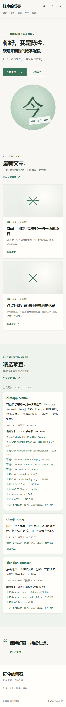
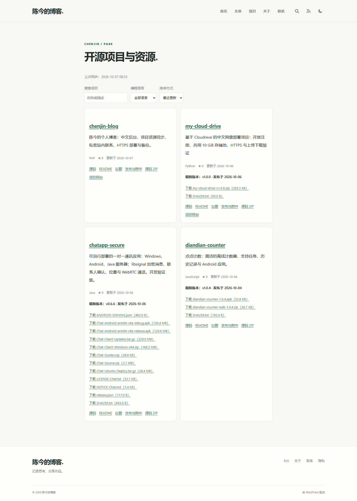

# 陈今博客 · Chenjin Blog

[](https://github.com/wobuyaoquminga/chenjin-blog/actions/workflows/checks.yml)
[](https://github.com/wobuyaoquminga/chenjin-blog/releases/latest)
[](LICENSE)

基于 WordPress 的中文个人博客，包含 News 风格子主题、GitHub 公开项目目录和无需邮箱的私密联系表单。适合在个人博客中同时发布文章、展示开源作品和提供项目下载入口。

[在线演示](https://121.43.101.242/blog/) · [项目资源页](https://121.43.101.242/blog/projects/) · [下载最新版本](https://github.com/wobuyaoquminga/chenjin-blog/releases/latest) · [报告问题](https://github.com/wobuyaoquminga/chenjin-blog/issues)


<details>
<summary>查看手机布局</summary>



</details>

## 功能

- **文章与阅读**：使用 WordPress 原生文章、分类、标签、草稿、修订、定时发布、媒体、搜索、分页和 RSS；子主题提供文章目录、代码复制及桌面/手机布局。
- **项目与下载**：分页读取 GitHub 公开仓库，包含 Fork 与归档项目；支持搜索、语言筛选、排序、README、源码、Issues、最新 Release 和附件下载。同步失败保留最近成功的缓存。
- **私密联系**：访客填写昵称、主题和正文，无需邮箱；管理员在「站内来信」查看和删除。来信不进入公开搜索、RSS 或 REST API。
- **管理与运维**：中文后台、评论审核、可自定义导航和 Logo；服务器部署方案包含独立 PHP-FPM、定时任务、登录重试限制与数据库/文件备份。

当前仅保留 `chenjin-news` 子主题和它所依赖的官方 Blocksy 父主题。

## 下载

从 [Releases](https://github.com/wobuyaoquminga/chenjin-blog/releases/latest) 选择所需文件：

- `chenjin-blog-1.1.2.zip`：完整源码、部署脚本、文档和截图。
- `chenjin-news-1.1.1.zip`：可通过 WordPress 后台上传的子主题。
- `chenjin-github-1.0.0.zip`：GitHub 公开项目同步插件。
- `chenjin-contact-1.0.0.zip`：站内联系插件。
- `SHA256SUMS.txt`：上述文件的 SHA-256 校验值。

发布包版本与组件版本分别管理。本仓库不包含 WordPress 内核、Blocksy 父主题、生产数据库、上传附件或账号凭据。

## 快速开始

**已有 WordPress 网站：**

1. 备份网站，在测试站点安装官方 [Blocksy](https://wordpress.org/themes/blocksy/) 父主题。
2. 上传并启用 News 子主题以及两个插件。
3. 创建首页与文章列表页，在「设置 → 阅读」指定静态首页和文章页。
4. 创建项目页和联系页，分别添加 `[ws_projects]` 与 `[chenjin_contact]` 短代码。
5. 在「设置 → GitHub 项目」点击「立即同步」，在「外观」配置菜单和文章卡片布局。

当前同步账号默认为演示站点的 `wobuyaoquminga`。部署自己的项目目录时，需要修改插件中的 `WS_GITHUB_USER` 常量，然后重新同步；当前版本尚未提供后台账号切换选项。完整步骤、页面路径和 News 布局初始化见 [安装指南](docs/INSTALLATION.md)。

**Ubuntu 服务器部署：**

`deploy/` 提供 Ubuntu 24.04 + PHP 8.3 + MySQL 8 + Nginx 的子路径部署方案。脚本需要现成的 HTTPS 虚拟主机和数据库管理权限；还包含特定 Cloudreve 环境的 Service Worker 兼容配置。**直接运行前必须按自己的服务器调整配置**，见 [部署说明](docs/DEPLOYMENT.md)。

## 使用示例

在 WordPress 页面中添加短代码区块：

```text
[ws_projects]
[ws_projects limit="3"]
[chenjin_contact]
```

完整项目列表提供搜索和筛选；`limit="3"` 展示按 Star 数排序的三个项目。项目插件注册每小时同步事件：普通 WordPress 使用访问触发的 WP-Cron，服务器方案由系统 Cron 定时处理到期任务。站内联系表单仅向管理员保存来信，不发送邮件。



## 文档

- [安装指南](docs/INSTALLATION.md)：已有 WordPress 的组件安装、页面与菜单配置、替换同步账号。
- [使用指南](docs/USER-GUIDE.md)：发文、媒体、评论、项目同步和站内来信。
- [部署与更新](docs/DEPLOYMENT.md)：服务器要求、路径、升级及更换域名。
- [备份与恢复](docs/BACKUP.md)：数据库与文件备份、校验和恢复步骤。
- [验证记录](docs/VALIDATION.md)：实际检查结果与未验证范围。
- [更新记录](CHANGELOG.md)、[贡献指南](CONTRIBUTING.md)、[安全政策](SECURITY.md)、[第三方来源](THIRD-PARTY.md)。

## 开发

```bash
git clone https://github.com/wobuyaoquminga/chenjin-blog.git
cd chenjin-blog
find wp-content deploy -name '*.php' -exec php -l {} \;
php wp-content/plugins/chenjin-github/test-sync.php
php wp-content/plugins/chenjin-contact/test-validation.php
node --check wp-content/themes/chenjin-news/reading.js
node --check wp-content/plugins/chenjin-github/projects.js
bash -n deploy/install.sh deploy/update.sh deploy/backup.sh
```

GitHub Actions 自动执行语法、同步和联系验证检查。浏览器检查依赖 Playwright/Chrome；部分脚本会创建临时文章、评论或来信，应在自己的测试站点执行，配置方法见 [贡献指南](CONTRIBUTING.md)。

```text
wp-content/themes/chenjin-news/     News 子主题
wp-content/plugins/chenjin-github/  GitHub 项目插件
wp-content/plugins/chenjin-contact/ 私密联系插件
deploy/                            部署、配置与备份
tests/                             公网与浏览器检查
docs/                              文档与截图
```

## 功能边界

- 当前验证环境为 WordPress 7.1.2、Blocksy 2.1.58、PHP 8.3、MySQL 8 和 Nginx；其他版本需自行验证。
- GitHub API 使用匿名公开访问，存在请求额度与网络限制。下载链接指向原仓库，博客不复制托管项目安装包。
- 联系表单是管理员私密收件箱，当前没有访客账号、站内双向聊天或邮件通知。
- 服务器方案提供本地备份，异地备份和 SMTP 需自行配置；未做大流量压测或第三方安全认证。
- 演示站点的品牌、示例文章和截图内容不代表安装者的信息，需要自行替换。

## 许可证与反馈

本仓库自定义代码以 [GPL-2.0-or-later](LICENSE) 发布，上游组件保留各自许可证。文章和各项目下载资源适用其自身声明。

功能问题请提交 [Issue](https://github.com/wobuyaoquminga/chenjin-blog/issues/new/choose)，修复欢迎提交 Pull Request。安全问题或私密联系请使用 [站内联系](https://121.43.101.242/blog/contact/)，不要在公开仓库提交个人资料、密码、Cookie、私钥或数据库。
